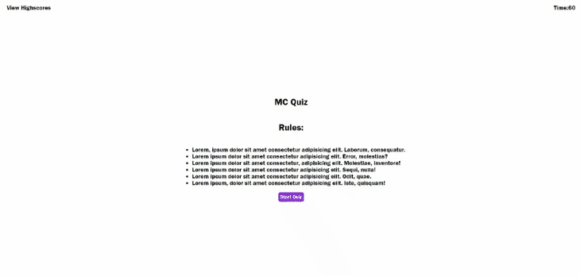

# Weekly Challenge 4 - Web APIs - Quiz Web App

## Table of Contents
- [Description](#description)
- [Features](#features)
- [Deployment](#deployment)
- [Usage](#usage)
- [Links](#links)
- [Credits](#credits)
- [License](#license)

## Description
The Quiz Web App is an interactive web application that offers a random selection of multiple-choice questions. Users can take the quiz, record their scores, and submit their initials to the high score leaderboard. The application also includes a timer that penalizes incorrect answers by reducing the remaining time.

## Features

1. **Randomly Generated Questions**
   - Questions are randomly selected from a pool.
   - Users see one question at a time with answer options.

2. **User Score**
   - Users accumulate scores based on correct answers.
   - Scores are displayed at the end of the quiz.

3. **Timer**
   - A countdown timer starts when the quiz begins.
   - Incorrect answers reduce the remaining time.
   - The quiz ends when the user has answered all questions or when the timer reaches zero.

4. **User Initials and High Scores**
   - Users enter their initials after the quiz.
   - Initials and scores are stored in local storage.
   - High scores are displayed in descending order.

## Deployment

Simply click on the provided URl in the [Links](#links) section to access the web application.

No dependencies and requirements.

## Usage

1. **Starting the Quiz**
    - Click the "Start Quiz" button on the start screen.

2. **Answering Questions**
    - Select answers to multiple-choice questions.

3. **Scoring and Timer**
    - Score increases for correct answers.
    - Timer counts down as you progress.
    - Incorrect answers reduce the timer.

4. **End of Quiz**
    - After the last question or when the timer ends, see your final score.
    - Enter initials and submit your score.

5. **Restarting the Quiz**
    - Click "Restart The Quiz" to start over.

6. **Clearing High Scores**
    - Click "Clear Highscores" to erase all high scores.

7. **Viewing High Scores**
    - Click "View Highscores" to see the leaderboard.
    - High scores are displayed with user initials and scores.

## Links

[Access the Quiz Web App here!]()

[Access my github here!](https://github.com/CYCBrian/Weekly-Challenge-4---MC-Quiz)

## Credits

## License

This project is licensed under the [MIT License](LICENSE). See the [LICENSE](LICENSE) file for details.
- - -
[Back to Top](#table-of-content)
- - -
© 2023 edX Boot Camps LLC. Confidential and Proprietary. All Rights Reserved.
